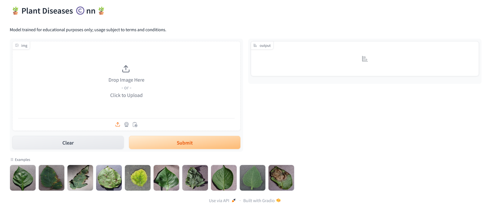
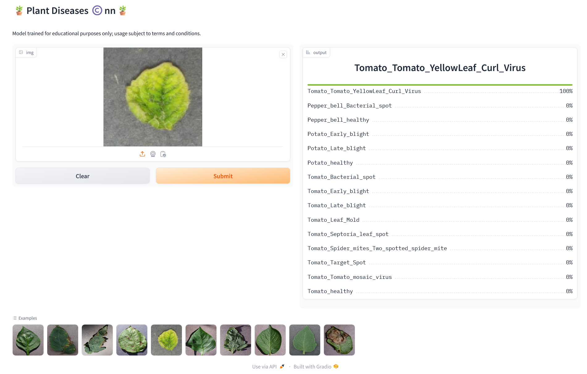

🪶Check out the configuration reference at https://huggingface.co/docs/hub/spaces-config-reference

🚀Huggingface space : https://huggingface.co/spaces/prithivMLmods/Plant-Diseases-Cnn

🚀To Clone Just Install Git Past the Command : git clone https://huggingface.co/spaces/prithivMLmods/Plant-Diseases-Cnn

## 📂➡️ Source Imagge for Disease Analysis :

## 🪴🪴Analyzed Result for the Plant Status : 

.

.

.
